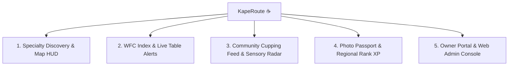

# ☕ KapeRoute — Philippine Specialty Coffee Discovery & Explorer Platform

<div align="center">


**The Premier Specialty Coffee Discovery, Community Tasting Feed, and Regional Explorer Platform for the Philippines.**

[](https://www.typescriptlang.org/)
[](https://expo.dev/)
[](https://reactnative.dev/)
[](https://firebase.google.com/)
[](LICENSE)

</div>

---

## 🌟 Overview

**KapeRoute** (v2.0) is a mobile and web application engineered specifically for the Philippine specialty coffee ecosystem. It connects coffee enthusiasts, remote workers, licensed Q-Graders, and artisanal café owners across 8 major Philippine coffee hubs.

---

## 🇵🇭 8 Official Philippine Specialty Coffee Regions

KapeRoute features dedicated discovery and offline hubs across 8 specialty coffee regions:

| # | Regional Hub | Island Group | Specialty Distinction |
|:---:|---|---|---|
| **1** | **Metro Manila** | Luzon | Capital Specialty Epicenter (*Tomas Morato, Legazpi Makati, BGC, Maginhawa*) |
| **2** | **Baguio & Benguet** | Luzon (Cordillera) | High-altitude Arabica Typica & Bourbon from Atok and Tublay |
| **3** | **Sagada & Mt. Province** | Luzon (Highlands) | Heritage mountain Arabica, slow-washed lots, and high-elevation micro-climates |
| **4** | **La Union Surf Coast** | Luzon | San Juan specialty strip, cold brew bars, and coastal third-wave roasteries |
| **5** | **Antipolo & Rizal Ridge** | Luzon | Overlooking ridge roasteries with scenic Sierra Madre views |
| **6** | **Cebu City & Visayas** | Visayas | Queen City roastery culture, pour-over bars, and competition barista hubs |
| **7** | **Iloilo City Heritage** | Visayas | Historic Spanish-era heritage mansions paired with modern specialty brews |
| **8** | **Davao & Mt. Apo** | Mindanao | Award-winning Anaerobic micro-lots from the volcanic slopes of Mt. Apo & Bukidnon |

---

## ✨ Core Features



### 1. 🗺️ Specialty Discovery & In-App Navigation HUD
- **Smooth Regional Camera Flight**: 1-tap switching between all 8 Philippine regional hubs with auto-panning camera animations.
- **Turn-by-Turn Routing HUD**: Real-time walking and driving distance, ETA calculations, and polyline navigation overlays.
- **Specialty Standard / Satellite / Terrain Switcher**: Clean vector road maps, aerial photography, and highland mountain topography layers.
- **Instant Filters**: Filter by GCash/QRPh acceptance, power outlet availability, noise level, and Philippine single-origin beans (*Sagada, Mt. Apo, Benguet, Barako*).

### 2. ⚡ Work-From-Café (WFC) Scorecard & Live Table Alerts
- **Verified WFC Index**: Dedicated scorecard measuring:
  - ⚡ **Power Outlets**: *Available at tables*, *Wall-only shared sockets*, or *Weekend laptop policy*.
  - 📶 **Wi-Fi Speed**: Real-time verified connection benchmarks (*e.g., 250 Mbps+*).
  - ❄️ **A/C & Climate**: *High A/C (Jacket Recommended)*, *Comfortable Cool*, or *Al Fresco Breezy*.
  - 🎧 **Noise Meter**: *Zoom-Call Friendly*, *Moderate Café Ambience*, or *Lively Music*.
- **🔔 Live Table Availability & Watcher**: Live occupancy indicators (*🟢 Available, 🟡 Moderate, 🔴 Busy*) with a 1-tap **"Alert Me"** watcher when tables free up.

### 3. ☕ Community Tasting Feed & Sensory Radar
- **Cupping Sensory Radar**: Tri-axis sensory balance meter evaluating **Acidity**, **Sweetness**, and **Body** (1–5 scale).
- **Philippine Single-Origin Chips**: Tagged bean varieties, processing methods (*Washed, Honey, Anaerobic*), and brew methods (*V60, Aeropress, Espresso, Cold Drip*).
- **🎖️ Licensed Q-Grader & Master Roaster Badges**: Distinct visual badge verification for certified cuppers, head roasters, and professional baristas.
- **Dynamic Rating Re-calculation**: Reviews dynamically re-compute the café's aggregate rating and user rating counts in real time.
- **Fullscreen Image Lightbox**: High-resolution cupping photo viewer with sharing capabilities.

### 4. 📸 Photo-Proof Coffee Passport & City Explorer Level XP
- **Photo-Proof Cup & Spot Check-In**: Snap a photo of your cup or café to unlock regional stamps without the friction of physical counter barcodes.
- **Philippine Coffee Passport**: Visual stamp booklet displaying digital stamps unlocked across all 8 regions.
- **City & Regional Rank Tiers**:
  - 🥉 **Level 1: Bronze Cupper** (1–2 spots logged)
  - 🥈 **Level 2: Silver Regular** (3–4 spots logged)
  - 🥇 **Level 3: City Trailblazer** (5–9 spots logged)
  - 👑 **Level 4: Roastmaster Legend** (10+ spots logged)
- **National Explorer Level XP**: Overall progression meter (*Coffee Novice → Caffeine Scout → Specialty Connoisseur → Philippine Coffee Legend*).

### 5. 🛡️ Business Permit Verification & Dual Admin Consoles
- **Fraud-Proof Verification**: Claim ownership by submitting DTI / SEC registration numbers or Mayor's Business Permits with encrypted photo attachments.
- **In-App Mobile Admin Console**: PIN-locked (`102403`) and email-whitelisted moderation panel in the user profile.
- **Web Administrator Portal (`localhost:3000`)**: Independent JavaScript administrative web application (`web-admin/app.js` + `server.js`) for full-screen permit inspection and badge approvals.

### 6. 📶 100% Offline Mountain Trek Packs
- Full regional offline bundle downloads enabling 100% offline map discovery, café listings, coordinates, and emergency numbers in remote mountain regions (*Sagada, Benguet, Mt. Apo*) with zero cell signal.

---

## 🛠️ Architecture & Tech Stack

```
CoffeeFinder/
├── src/
│   ├── components/           # UI Components
│   │   ├── CoffeeMarker.tsx      # Map Pin Markers
│   │   ├── FilterBar.tsx         # Category & Amenity Chips
│   │   ├── ImageLightboxModal.tsx# Fullscreen Cupping Photo Viewer
│   │   ├── InsiderTipsSection.tsx# Parking, Plugs & Off-Menu Tips
│   │   ├── PhotoMosaic.tsx       # 3-Photo Tiled Mosaic Header
│   │   ├── PhotoPassportModal.tsx# Photo-Proof Camera Stamp Check-in
│   │   ├── RatingStars.tsx       # Star Rating & GCash Badge
│   │   ├── RegionSelector.tsx    # 8-Region Hub Switcher
│   │   ├── ReviewComposerModal.tsx # Cupping Review Submission Modal
│   │   ├── ReviewsList.tsx       # Tasting Feed with Q-Grader Badges
│   │   ├── RoutePolyline.tsx     # Map Navigation Routing Polyline
│   │   ├── SearchBar.tsx         # Keyword & Single-Origin Search
│   │   ├── ShopCard.tsx          # Café Discovery Preview Cards
│   │   ├── TastingNotesSection.tsx # Barista Recipes & Notes
│   │   └── TastingRadarSummary.tsx # Acidity/Sweetness/Body Radar
│   ├── constants/            # Design System, 8 Regional Hubs & Mock Data
│   ├── hooks/                # Custom React Hooks (Location, Favorites)
│   ├── navigation/           # React Navigation Bottom Tabs & Stacks
│   ├── screens/              # Core Application Screens
│   │   ├── DetailScreen.tsx      # Café Deep Dive, WFC Index & Menu
│   │   ├── FavoritesScreen.tsx   # Saved Cafés & Offline Packs
│   │   ├── MapScreen.tsx         # Interactive Map & Navigation HUD
│   │   ├── OwnerPortalScreen.tsx # Owner Verification & Live Seating
│   │   └── ProfileScreen.tsx     # Coffee Passport, Level XP & Admin
│   ├── services/             # Firebase Firestore, Auth & Google APIs
│   ├── store/                # Zustand Global State Management
│   ├── types/                # TypeScript Interfaces & Definitions
│   └── utils/                # Haptics, Formatters & Storage Helpers
├── web-admin/                # Dual Web Administration Portal
│   ├── app.js                    # Web Admin Client Logic
│   ├── index.html                # Modern Glassmorphic Admin Dashboard
│   └── server.js                 # Node.js Static & API Server
├── app.json                  # Expo Project Configuration
├── package.json              # Dependencies & Scripts
└── tsconfig.json             # TypeScript Compiler Options
```

---

## 🚀 Getting Started

### 1. Prerequisites
- **Node.js**: v18.0.0 or higher
- **Expo Go App** (iOS / Android) or simulator

### 2. Installation
```bash
# Clone the repository
git clone https://github.com/kashumadesu/CoffeeFinder.git
cd CoffeeFinder

# Install dependencies
npm install
```

### 3. Running the Mobile App
```bash
# Start Expo development server
npx expo start -c
```
- Press `a` for Android emulator
- Press `i` for iOS simulator
- Scan the QR code with **Expo Go** on your physical iOS/Android device.

### 4. Running the Web Admin Portal
```bash
# Launch the Web Administrator console
npm run web:admin
```
Open **[http://localhost:3000](http://localhost:3000)** in your browser and enter the master PIN: `102403`.

---

## 🧪 Code Quality & Verification

```bash
# Run ESLint static analysis
npm run lint

# Run TypeScript compiler check
npx tsc --noEmit
```

- **TypeScript**: 0 errors
- **ESLint**: 0 errors, 0 warnings

---

## 📄 License

Distributed under the **MIT License**. See `LICENSE` for more information.

<div align="center">
  <b>Built with ☕ for Philippine Specialty Coffee</b>
</div>
